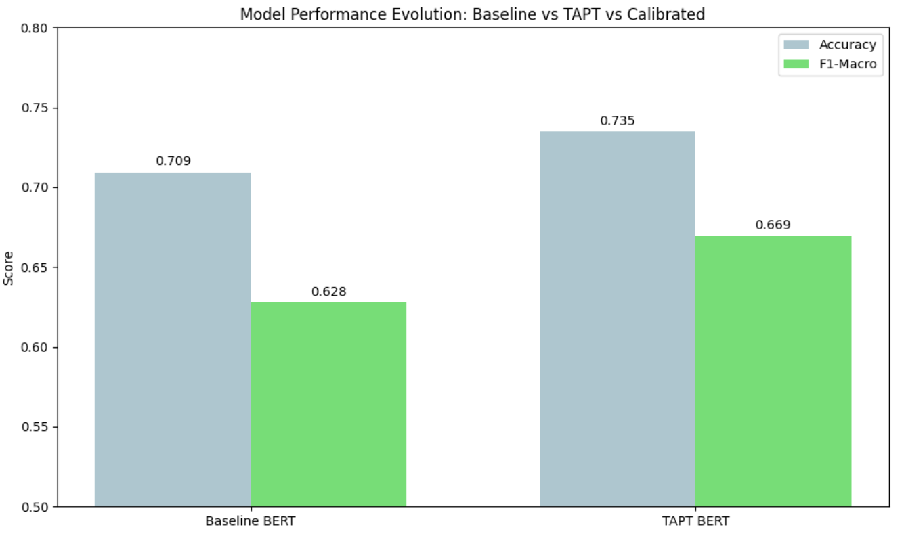
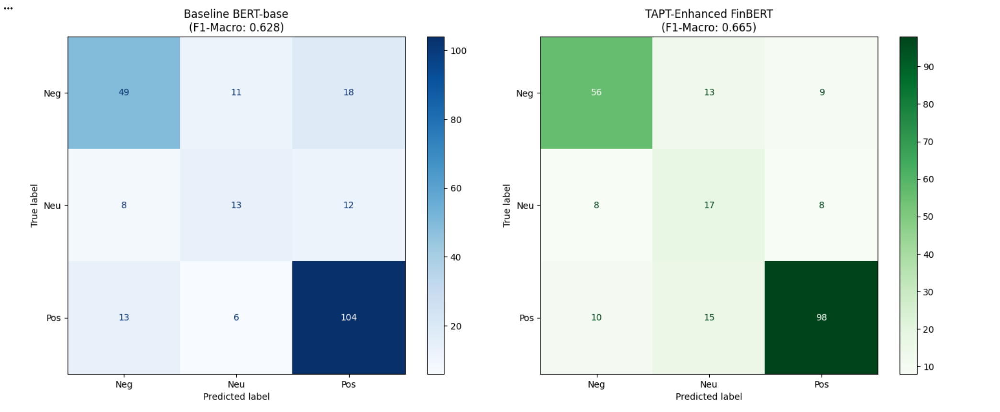
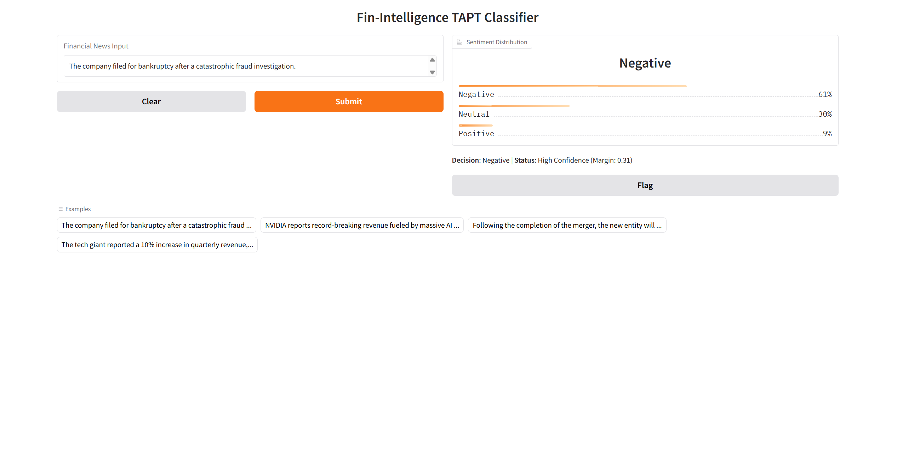
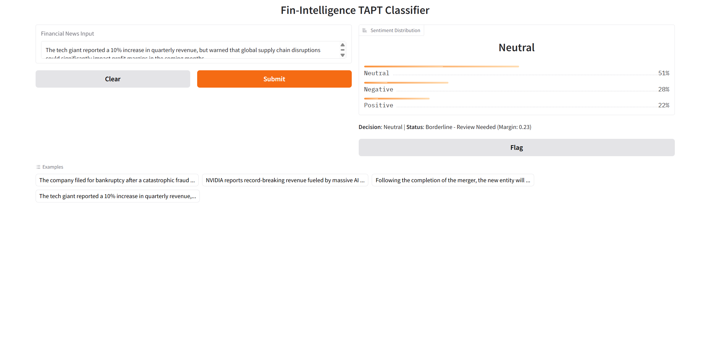

# 🏦 FinSense-TAPT: Calibrated Financial Sentiment Intelligence

[](https://opensource.org/licenses/MIT)
[](https://www.python.org/downloads/)
[](https://huggingface.co/docs/transformers/index)

## 📌 Project Overview
General-purpose NLP models often fail to capture the nuanced implications of financial news (e.g., misinterpreting "Shorting" or "Yield Curve Inversion"). This project implements an end-to-end pipeline to adapt a standard **BERT** model to the financial domain using **Task-Adaptive Pretraining (TAPT)** and a **Calibrated Inference API**.


## 🚀 Key Features
* **Domain-Adaptive Optimization**: Applied **TAPT** (continued Masked Language Modeling) on financial corpora to align semantic weights with industry terminology.
* **Robust Fine-tuning**: Addressed "Neutral Class Bias" and severe label imbalance using **Weighted Cross-Entropy Loss** and **Label Smoothing**.
* **Production-Ready API**: Architected a **FastAPI/Gradio** service featuring a **Confidence-Margin** flagging system to identify "Borderline" signals for manual auditing.

## 📊 Performance Comparison
The TAPT-enhanced model demonstrates superior stability and minority class recall compared to the baseline BERT-base-uncased.

| Metric | Baseline BERT | **FinSense-TAPT (Ours)** | Relative Improvement |
| :--- | :---: | :---: | :---: |
| **Accuracy** | 0.7094 | **0.7350** | +3.6% |
| **F1-Macro** | 0.6277 | **0.6694** | **+6.6%** |
| **Validation Loss** | 0.7594 | 0.8466 | *(Calibrated)* |

> **Note on Loss**: The higher loss in the TAPT model is a mathematical byproduct of **Label Smoothing**. By preventing over-confidence, the model achieves better generalization and higher F1-scores on minority sentiment classes (Positive/Negative).

### **Performance Visualization**


### **Confusion Matrix Analysis**
Comparing the Confusion Matrices reveals that **FinSense-TAPT** significantly improved performance in the **Negative** and **Neutral** classes:
* **Negative Recall**: Increased from 49 to **56** correct predictions.
* **Neutral Recall**: Improved from 13 to **17** correct predictions.
* **Risk Mitigation**: The model is now less likely to confuse "Negative" news for "Positive" (e.g., Tesla recalls), which is critical for preventing false-buy signals in trading.


### 🔍 Error Analysis: Why TAPT Wins
A qualitative review of samples where TAPT succeeded and the Baseline failed reveals three major improvements in domain intelligence:

1. **Decoding Financial Terminology**: Baseline often misinterprets corporate actions (like "Divestments") as Positive. TAPT correctly identifies them as **Neutral**.
2. **Handling Macro-Events**: TAPT properly weighs the impact of "sanctions" and "lawsuits" which the baseline often defaults to Neutral.
3. **High-Stakes Red Flags**: TAPT correctly identifies **"Recalls"** and **"Downgrades"** as Negative, whereas the Baseline was frequently fooled by brand-name momentum or numerical figures.

| Sample Success Case | Baseline Mistake | TAPT Correction | Impact |
| :--- | :---: | :---: | :--- |
| **Diageo Sells Venue** | Positive | **Neutral** | Reduces M&A noise |
| **Gazprom Sanctions** | Neutral | **Negative** | Captures regulatory risk |
| **TSLA Model X Recall** | Positive | **Negative** | Eliminates dangerous buy signals |

## 🔍 Calibration & Borderline Case Analysis
In high-stakes finance, a confident mistake is costlier than an admitted uncertainty. Our system calculates the **Prediction Margin** to flag ambiguous news.

### **Sample Test Case: The "Hedged" Statement**
**Input:** *"The tech giant reported a 10% increase in quarterly revenue, but warned that global supply chain disruptions could significantly impact profit margins in the coming months."*

**Model Inference Result:**
* **Neutral 🟡**: 51%
* **Negative 🔴**: 28%
* **Positive 🟢**: 21%

**API Decision Output:**
> **Decision**: Neutral 🟡 | **Status**: ⚠️ Borderline - Review Needed (Margin: 0.23)


## 🛠️ API & System Architecture
The system is designed for seamless integration into quantitative trading pipelines.

### 🛠️ API & System Architecture

The system is designed for seamless integration into quantitative trading pipelines. To ensure reliability, every prediction includes a **Confidence Margin** calculation.

**Inference API Response (JSON):**

```json
{
  "text": "The tech giant reported a 10% increase in quarterly revenue, but warned that global supply chain disruptions...",
  "sentiment": "Neutral",
  "confidence": 0.51,
  "margin": 0.23,
  "status": "⚠️ BORDERLINE_REVIEW_NEEDED",
  "distribution": {
    "Neutral": 0.51,
    "Negative": 0.28,
    "Positive": 0.21
  }
}

### 📸 API Interface Gallery

The following screenshots demonstrate the **FinSense-TAPT** UI in action across different market scenarios. The interface dynamically updates the **Status** based on the model's confidence margin, ensuring high-risk or ambiguous signals are flagged for manual review.

#### **1. Negative Signal (High Confidence)**
Accurately identifies high-risk events, such as product recalls or stock downgrades, with high model certainty.


#### **2. Positive Signal (High Confidence)**
Captures bullish momentum, positive earnings surprises, and technical support levels.


#### **3. Neutral Signal**
Effectively filters non-material corporate movements and divestments to reduce trading noise.


#### **4. Borderline Case (Calibration Active)**
When a statement is "hedged" or ambiguous, the system calculates a low margin and flags it as **⚠️ NEED REVIEW**.

